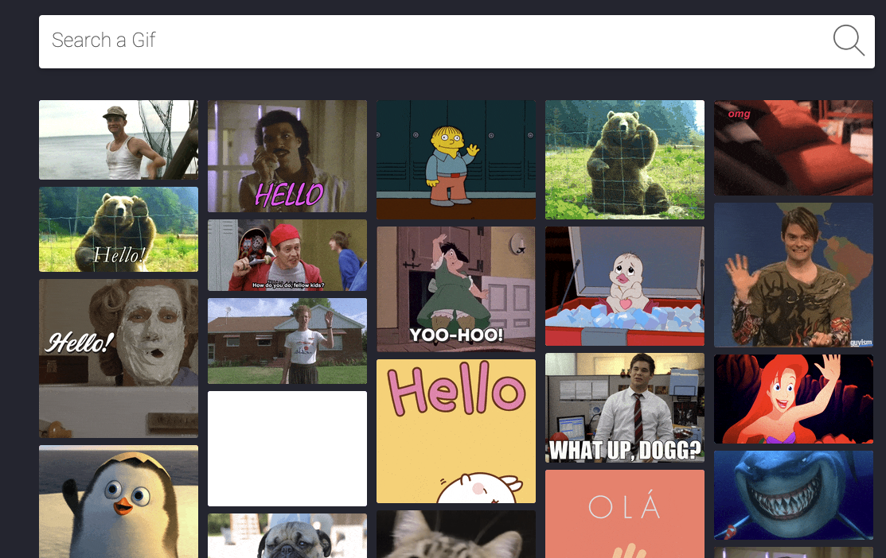

### National Gif Relief

## How to run the app?

1. Clone the repository to your computer through the terminal.

2. Go to the project folder in your terminal.

3. Run `yarn install` command in the terminal and wait until it finishes downloading.

4. After completing the step 3, run `yarn start` in your terminal. A new tab will be opened in your web browser automatically. If a new tab won't be opened in your browser, please go to `localhost:3000/` to run the app.